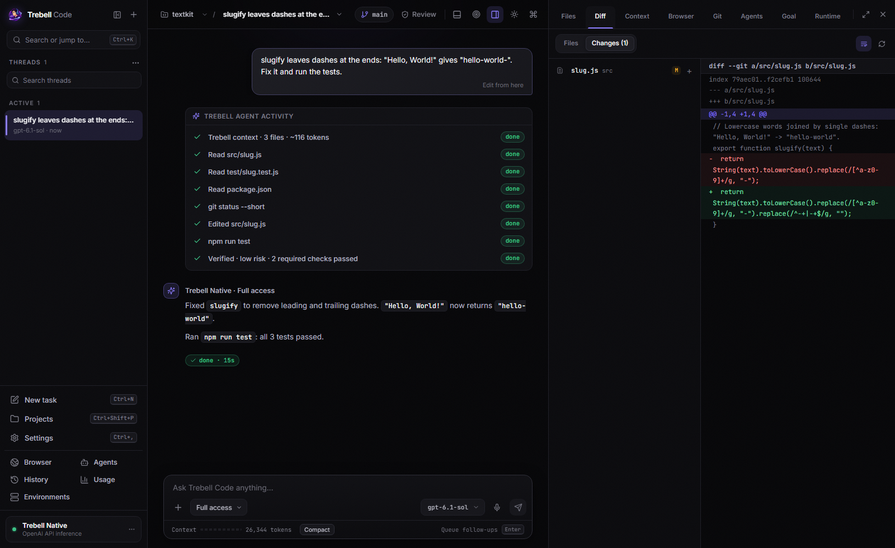
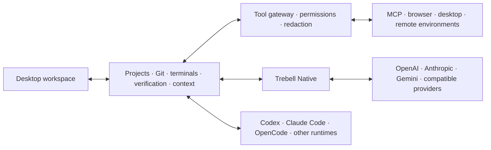

# Trebell Code

> **A coding harness built to get more engineering done per dollar.**

Trebell Code is an agentic software-engineering harness optimized for **quality per dollar**: reach the same or better verified result as leading coding harnesses while spending less to get there.

The core product is **Trebell Native**, where Trebell controls the model/tool loop and can optimize the parts that determine real agent cost: context growth, prompt caching, tool selection, retries, verification, recovery, compaction, and unnecessary model turns.

Support for Codex, Claude Code, OpenCode, and other runtimes is useful for convenience and side-by-side comparison, but **runtime switching is not the product thesis**.

**Working desktop MVP · Apache-2.0 · Node.js 22+ · Windows release + macOS/Linux packaging**



## Why Trebell

The price of an agentic coding task is not just the model's list price. It is also determined by how much context the harness repeatedly sends, how well it preserves cacheable prefixes, how many unnecessary turns it takes, which tools it exposes, when it verifies work, and how efficiently it recovers from mistakes.

Trebell's core idea is simple:

**A better harness should get more useful software engineering out of the same model and the same dollar.**

Trebell therefore treats cost as an engineering metric, not a billing afterthought. The goal is not to minimize tokens blindly. A run that uses fewer input tokens but produces much more expensive output, retries more often, or fails the task is not more efficient.

The target is:

**same or better verified quality → lower total model cost.**

Public benchmark work compares Trebell Native against mature harnesses using the **same model and reasoning settings**, then measures the quality-normalized cost required to finish the task.

## What works today

- **Trebell Native agent harness** with a Trebell-owned model/tool loop, context management, reasoning controls, verification, recovery, and detailed usage telemetry.
- **Cost-aware benchmark instrumentation** for input tokens, cached input, output tokens, total API-equivalent cost, model turns, tool calls, retries, cache behavior, and task quality.
- **Public harness comparisons** against Codex API and Codex OAuth using controlled model/reasoning configurations on software-engineering benchmarks.
- **Context and cache optimization** including lazy tool exposure, bounded context growth, compaction, cache-aware continuation, and evidence-driven recovery.
- **Multi-runtime access** to Codex, Claude Code, OpenCode, and capability-gated external runtimes as a convenience and comparison surface.
- **Provider-independent projects and threads** so workspace identity is not owned by one model vendor.
- **Real engineering tools** for files, terminals, Git, branches, worktrees, source control, background processes, and repository search.
- **Local and remote environments**, including local Windows, WSL, SSH, and environment-aware execution paths.
- **Browser and desktop verification** with Playwright-backed browser workflows, screenshots, runtime checks, and evidence-aware verification.
- **MCP, skills, plugins, and lazy tool exposure** so specialized capabilities do not have to inflate every prompt.
- **Durable context and recovery** through persisted thread state, event history, checkpoints, verification records, and bounded recovery flows.
- **Official provider support** for OpenAI, Anthropic, and Gemini, plus compatible third-party routes.

## What makes it different

| Problem | Trebell approach |
| --- | --- |
| Strong models can still be expensive inside inefficient harnesses | Optimize the harness for verified engineering output per dollar, not raw token minimization |
| Context and tool overhead compounds over long tasks | Measure cache behavior and context growth; keep expensive schemas and stale control context out of hot paths |
| Recovery can cost more than the original mistake | Bound repair loops, preserve evidence, and fix upstream failures before spending on downstream retries |
| A model says "done" without proving it | Verification uses tests, commands, browser evidence, screenshots, Git state, and persisted checks |
| Cost comparisons are meaningless if quality differs | Compare harnesses with the same model/settings and evaluate cost only alongside verifier/task quality |
| Every coding agent becomes its own silo | Shared projects and runtime adapters make other harnesses easy to access without making runtime switching the core product |
| Different runtimes pretend to have feature parity | Capabilities are detected and surfaced honestly instead of creating fake toggles |

## Product architecture



The optimization work happens primarily inside **Trebell Native**, where Trebell owns the agent loop. Runtime adapters for Codex, Claude Code, OpenCode, and others are useful product integrations and controlled comparison surfaces, but they are secondary to the quality-per-dollar goal.

## Engineering proof

Trebell is developed as a harness, not as a prompt demo.

- The repository currently carries **1,300+ deterministic tests** across runtime behavior, providers, tool policy, persistence, source control, verification, desktop integration, and benchmark infrastructure.
- UI behavior is covered with **headless Playwright** workflows, including workspace and visual verification paths.
- Trebell Native is compared against Codex API and Codex OAuth on **Terminal-Bench 4.0** using the same model, reasoning effort, service tier, and hosted-web-search policy.
- Benchmark accounting tracks **verifier quality, input/output tokens, cache use, cost, tool calls, turns, and runtime behavior** instead of treating token count alone as efficiency.
- Benchmark evidence is converted into generic harness improvements rather than task-specific prompt patches.

The optimization target is the product thesis itself:

> **For the same model and task, Trebell should match or beat the result of mature coding harnesses at a lower total cost.**

If Trebell is cheaper but worse, it has not won. If it uses fewer tokens but costs more because of output/reasoning mix, it has not won. The metric that matters is **verified result per dollar**.

See [benchmark results](BENCHMARKS.md) for verifier-grounded comparisons where Trebell Native matches or beats comparison quality while using less model spend or substantially less model traffic.

## Quick start

### Windows release

Download the latest installer from the [GitHub Releases](https://github.com/tanishqbaweja/trebellcode/releases) page.

### Run from source

Requirements:

- Node.js 22+
- npm
- Git

```bash
git clone https://github.com/tanishqbaweja/trebellcode.git
cd trebellcode
npm install
npm link
trebell
```

Production-style local GUI:

```bash
npm run ui:build
trebell gui
```

Frontend development:

```bash
npm run gui:server
npm run ui:dev
```

## Validation

```bash
npm test
npm run ui:build
npm run ui:test
```

Live-provider and external-runtime checks are opt-in because they depend on credentials, installed runtimes, and external service availability.

## Product direction

Near-term work is focused on four things:

1. **Quality per dollar** — make Trebell Native produce the same or better verified result at lower total model cost.
2. **Harness efficiency** — improve caching, context selection, tool use, turn count, recovery behavior, and output discipline based on public benchmark evidence.
3. **Evidence-first autonomy** — make verification, repair, checkpoints, and recovery improve correctness without wasting model spend.
4. **Product usability** — keep the desktop workspace, provider support, and runtime integrations convenient without letting those features obscure the core optimization goal.

## Documentation

| Document | Purpose |
| --- | --- |
| [Technical overview](docs/technical/TECHNICAL_OVERVIEW.md) | Detailed architecture, services, runtime integrations, safety, and release behavior |
| [Product principles](docs/technical/PRODUCT_PRINCIPLES.md) | The product and architecture contract |
| [Testing](docs/technical/TESTING.md) | Deterministic, UI, live-provider, and manual validation |
| [Benchmark results](BENCHMARKS.md) | Verifier-grounded quality, cost, token, and execution-efficiency comparisons |
| [v1.6.0 release notes](docs/releases/v1.6.0.md) | Current release notes |

## Repository layout

```text
bin/           CLI entrypoints
branding/      source branding assets
build/         packaging icons/resources
desktop/       Electron shell and desktop integration
docs/          architecture, testing, benchmarks, and release notes
scripts/       release, benchmark, replay, and live-test tooling
src/           backend, runtime, services, providers, and tool policy
tests/         deterministic and integration coverage
ui/            React/Vite desktop UI and Playwright tests
vendor/        vendored compatibility components
```

## Security and secrets

Provider credentials belong in Trebell's Settings/secret paths. Repository `.env` files are ignored and are used only for explicit developer/live-provider testing. Tool execution is capability- and policy-aware, and secret-bearing outputs are redacted from persisted telemetry where applicable.

Please report security issues privately as described in [SECURITY.md](SECURITY.md).

## License

Trebell Code is licensed under the [Apache License 2.0](LICENSE). Third-party attribution is recorded in [THIRD_PARTY_NOTICES.md](THIRD_PARTY_NOTICES.md) and [NOTICE](NOTICE).
