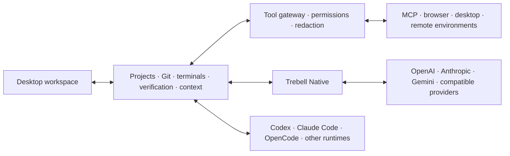

# Trebell Code

> **A desktop engineering harness for AI coding agents.**

Trebell Code gives coding agents a real software-engineering workspace instead of a chat box with a terminal attached. It keeps projects, source control, verification, context, permissions, recovery, and runtime state in one desktop product while letting developers choose the agent runtime and model provider that fit the job.

**Working desktop MVP · Apache-2.0 · Node.js 22+ · Windows release + macOS/Linux packaging**


## Why Trebell

Coding models are getting better quickly, but the surrounding engineering workflow is still fragmented. Different agents own different conversations, tools, permission models, terminals, browser flows, and project state.

Trebell's core idea is simple:

**the model and agent runtime should be replaceable; the engineering workspace should not be.**

That means a developer can use Trebell Native, Codex, Claude Code, OpenCode, or another supported runtime without rebuilding the surrounding workflow every time.

## What works today

- **Multi-runtime coding workspace** with Trebell Native, Codex, Claude Code, OpenCode, and capability-gated external runtimes.
- **Provider-independent projects and threads** so workspace identity is not owned by one model vendor.
- **Real engineering tools** for files, terminals, Git, branches, worktrees, source control, background processes, and repository search.
- **Local and remote environments**, including local Windows, WSL, SSH, and environment-aware execution paths.
- **Browser and desktop verification** with Playwright-backed browser workflows, screenshots, runtime checks, and evidence-aware verification.
- **MCP, skills, plugins, and lazy tool exposure** so specialized capabilities do not have to inflate every prompt.
- **Durable context and recovery** through persisted thread state, event history, checkpoints, verification records, and bounded recovery flows.
- **Trebell Native**: a Trebell-owned agent loop with tool policy, context management, reasoning controls, usage telemetry, and direct provider support.
- **Official provider support** for OpenAI, Anthropic, and Gemini, plus compatible third-party routes.

## What makes it different

| Problem | Trebell approach |
| --- | --- |
| Every coding agent becomes its own silo | Projects, threads, repository state, and engineering services live above the model/provider layer |
| A model says "done" without proving it | Verification uses tests, commands, browser evidence, screenshots, Git state, and persisted checks |
| Tool schemas and old context become expensive | Heavy namespaces are lazy, tool/context growth is measured, and Native is benchmarked for cost as well as quality |
| Different runtimes pretend to have feature parity | Capabilities are detected and surfaced honestly instead of creating fake toggles |
| Recovery means starting over | Trebell persists task state, checkpoints, evidence, and bounded repair/recovery paths |

## Product architecture



The important separation is between **agent runtime** and **inference provider**. Trebell Native can use different model providers, while external harnesses keep their own native authentication and protocol behavior.

## Engineering proof

Trebell is developed as a harness, not as a prompt demo.

- The repository currently carries **1,300+ deterministic tests** across runtime behavior, providers, tool policy, persistence, source control, verification, desktop integration, and benchmark infrastructure.
- UI behavior is covered with **headless Playwright** workflows, including workspace and visual verification paths.
- Trebell Native is compared against Codex API and Codex OAuth on **Terminal-Bench 4.0** using the same model, reasoning effort, service tier, and hosted-web-search policy.
- Benchmark accounting tracks **verifier quality, input/output tokens, cache use, cost, tool calls, turns, and runtime behavior** instead of treating token count alone as efficiency.
- Benchmark failures are kept as engineering evidence and converted into generic harness changes rather than task-specific prompt patches.

The current optimization target is straightforward: **match or beat mature coding harnesses on real public software-engineering tasks while reducing the cost required to reach the same quality.**

See [Benchmarking](docs/benchmarks/HISTORY.md) for the methodology and full evidence ledger.

## Quick start

### Windows release

Download the latest installer from the [GitHub Releases](https://github.com/tanishqbaweja/trebellcode/releases) page.

### Run from source

Requirements:

- Node.js 22+
- npm
- Git

```bash
git clone https://github.com/tanishqbaweja/trebellcode.git
cd trebellcode
npm install
npm link
trebell
```

Production-style local GUI:

```bash
npm run ui:build
trebell gui
```

Frontend development:

```bash
npm run gui:server
npm run ui:dev
```

## Validation

```bash
npm test
npm run ui:build
npm run ui:test
```

Live-provider and external-runtime checks are opt-in because they depend on credentials, installed runtimes, and external service availability.

## Product direction

Near-term work is focused on four things:

1. **Harness efficiency** — improve Trebell Native against public coding benchmarks on quality, cost, cache behavior, and tool use.
2. **Runtime interoperability** — make switching between coding runtimes feel like changing an engine, not changing products.
3. **Evidence-first autonomy** — make verification, repair, checkpoints, and recovery normal parts of an agent turn.
4. **Product polish** — keep reducing setup friction, UI noise, fake capability parity, and operational failure modes.

## Documentation

| Document | Purpose |
| --- | --- |
| [Technical overview](docs/technical/TECHNICAL_OVERVIEW.md) | Detailed architecture, services, runtime integrations, safety, and release behavior |
| [Product principles](docs/technical/PRODUCT_PRINCIPLES.md) | The product and architecture contract |
| [Testing](docs/technical/TESTING.md) | Deterministic, UI, live-provider, and manual validation |
| [Benchmark history](docs/benchmarks/HISTORY.md) | Terminal-Bench methodology, evidence ledger, and historical results |
| [Benchmark engineering changes](docs/benchmarks/ENGINEERING_CHANGES.md) | Generic harness changes motivated by benchmark evidence |
| [v1.3.6 release notes](docs/releases/v1.3.6.md) | Current release notes |

## Repository layout

```text
bin/           CLI entrypoints
branding/      source branding assets
build/         packaging icons/resources
desktop/       Electron shell and desktop integration
docs/          architecture, testing, benchmarks, and release notes
scripts/       release, benchmark, replay, and live-test tooling
src/           backend, runtime, services, providers, and tool policy
tests/         deterministic and integration coverage
ui/            React/Vite desktop UI and Playwright tests
vendor/        vendored compatibility components
```

## Security and secrets

Provider credentials belong in Trebell's Settings/secret paths. Repository `.env` files are ignored and are used only for explicit developer/live-provider testing. Tool execution is capability- and policy-aware, and secret-bearing outputs are redacted from persisted telemetry where applicable.

Please report security issues privately as described in [SECURITY.md](SECURITY.md).

## License

Trebell Code is licensed under the [Apache License 2.0](LICENSE). Third-party attribution is recorded in [THIRD_PARTY_NOTICES.md](THIRD_PARTY_NOTICES.md) and [NOTICE](NOTICE).
